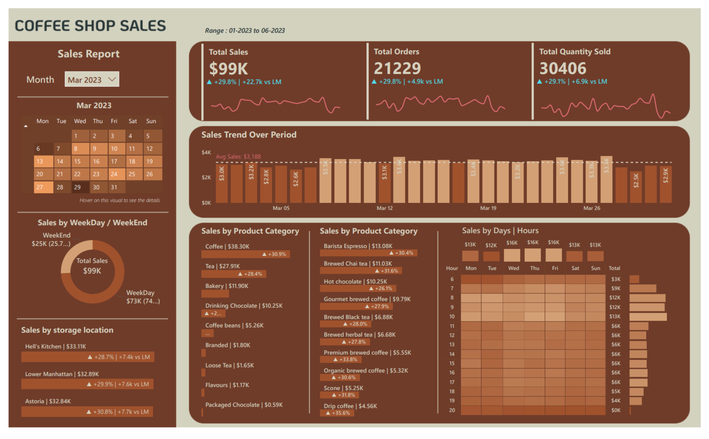

# ☕ Coffee Shop Sales Dashboard — Power BI


An interactive sales analytics dashboard built with Power BI Desktop, analyzing coffee shop sales data across multiple store locations from January 2023 to June 2023.

> 🎯 Built as a portfolio project to demonstrate data visualization and business intelligence skills using Power BI.

---

## 📊 Dashboard Preview



> *Open the PDF in the `exports/` folder for a full-quality view of the dashboard.*

---

## 📈 Key Metrics (March 2023 snapshot)

| Metric | Value | vs Last Month |
|---|---|---|
| Total Sales | $99K | ▲ +29.8% |
| Total Orders | 21,229 | ▲ +29.8% |
| Total Quantity Sold | 30,406 | ▲ +29.1% |

---

## 🔍 Dashboard Features

### 📅 Time Intelligence
- Month slicer with interactive calendar view
- Sales trend over period with weekly breakdown
- Day-of-week and hour-of-day heatmap analysis

### 🏪 Location Analysis
- Sales breakdown across 3 store locations:
  - Hell's Kitchen — $33.11K
  - Lower Manhattan — $32.89K
  - Astoria — $32.84K

### 🛒 Product Analysis
- Sales by product category (Coffee, Tea, Bakery, Drinking Chocolate, etc.)
- Top performing products by revenue
- Weekday vs Weekend sales comparison (74% vs 25.7%)

### ⏰ Time Pattern Analysis
- Sales by hour and day of week heatmap
- Peak hours identification (8AM–10AM highest traffic)
- Daily sales totals across the week

---

## 🗂️ Project Structure

```
coffee-sales-dashboard/
├── assets/          # Icons, images, theme assets
├── data/            # Source data files (Excel/CSV)
├── exports/         # Exported PDF/PNG snapshots
│   └── coffee_sales_dashboard_export.pdf
├── powerbi/         # Power BI project file (.pbix)
└── README.md
```

---

## 🧰 Tools Used

| Tool | Purpose |
|---|---|
| Power BI Desktop | Dashboard creation and visualization |
| Microsoft Excel / CSV | Data source |
| DAX | Calculated measures and KPIs |
| Power Query | Data cleaning and transformation |

---

## 💡 Key Insights

- **Coffee** is the top-selling category at $38.30K, followed by **Tea** at $27.91K
- **Weekdays** drive 74% of total sales vs 25.7% on weekends
- Peak sales hours are between **8AM and 10AM** across all locations
- All three store locations perform consistently with less than 1% difference in revenue
- **Barista Espresso** is the single best-selling product at $13.08K

---

## 🚀 How to Open

1. Clone this repository:
```bash
git clone https://github.com/safwan-km/coffee-sales-dashboard.git
```

2. Open the `.pbix` file from the `powerbi/` folder using **Power BI Desktop**
3. Use the Month slicer to explore data across different time periods

> 💡 Power BI Desktop is free to download from [Microsoft's official site](https://powerbi.microsoft.com/desktop/)

---

## 👨‍💻 Author

**Safwan KM**
[GitHub](https://github.com/safwan-km)

---

## 📄 License

This project is open source and available under the [MIT License](LICENSE).